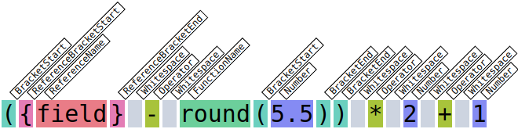
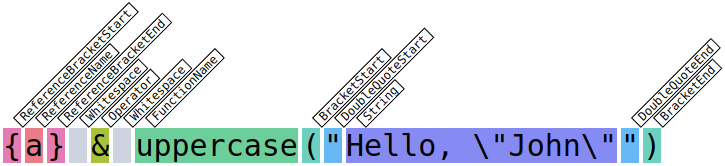
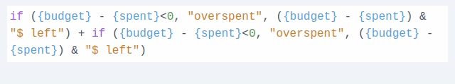

# Formula Parser in JavaScript/Vue/React

This work is the continuation/rethink of [this great article](https://andrewstevens.dev/posts/formula-parser-in-javascript/) written by Andrew Stevens. It's based on the source code of [CodeMirror](https://codemirror.net/) and [Marked.JS](https://marked.js.org/). 

We are going to implement formula parser which supports mathematical operators, bracers, functions, comparisons, and references to other formulas and variables. The engine is pure TypeScript with few dependencies. Also this work includes 2 demos, for Vue and React, with syntax highlight and various validations (syntax, non-defined or circular refs).

### The Spec
- There's an array of items like `{id: string; title: string; estimation: number; budget: number; loggedTime: number}`.
- The output is just a table, every row is an item, and every column is item property.
- A user can add columns of type `formula` and type in equation which can refer to other columns and formulas.
- A syntax like `({budget}-{loggedTime}/3600*{pricePerHour})*0.9` should be supported.
- Math operator precedence must be in place meaning `1+2*3` should evaluate to `7`.
- Ifs and comparisons should be supported by the excel syntax, `if({a}<{b},then,else})`.

### Links & Demo
- https://github.com/Kasheftin/formula-parser - Source code
- https://kasheftin.github.io/formula-parser/vue/index.html - Vue3 Demo
- https://kasheftin.github.io/formula-parser/react/index.html - React Demo

## Tokenization
Formula parser consists on serveral parts. Lexer and Tokenizer are used together for the initial split. Lexer is a general iterator which processes the string from start to end. It works with any syntax. Tokenizer is a bunch of regular expressions for our specific syntax, it should find the match and move the pointer. The result is an array of tokens. Every token is just `{type: string, value: string}`. For the formula like `1+2` it is

````TypeScript
[{ type: 'Number', value: '1' }, { type: 'Operator', value: '+' }, { type: 'Number', value: '2' }]
````

It does not filter out any characters from the input meaning if we join back token values we should get the initial formula. Visually tokenization is coloring out textual input like that:



Every character should be colored. We introduce quite a lot of types to simplify the future work. Tokenization is straight forward process running in one cycle without recursion. On every step it iterates over the regular expressions (order is important), the first match cuts out the matching part and repeats from the start. Since we don't use recursion, it's hard to tell if `)` is just a bracket or it belongs to a function. That's why we do not introduce different types of brackets.

We use a couple of tricky regular expression like `/^([^"\\]|\\.)+(?=")/`. This is what it does:

- it runs when inside a double quote (after the first `"`)
- it includes every character except the next `"` not including it ,`(?=")` does the trick
- but if it finds `\"` (escaped double quote) then it skips it until the next `"` 
- as the result, a string like `{a} & "Hello,\"John\""` correctly parses `Hello,"John"` as a string:



The live coloring demo is deployed on https://jsfiddle.net/kasheftin/8wLd4gbm/2/.

Here's [Lexer](https://github.com/Kasheftin/formula-parser/blob/master/shared/src/lexer.ts) and [Tokenizer](https://github.com/Kasheftin/formula-parser/blob/master/shared/src/tokenizer.ts) source code covered with [tests](https://github.com/Kasheftin/formula-parser/blob/master/shared/src/lexer.spec.ts).

## Node Generator

We have to convert tokens into evaluation tree, which has one root node, and it's mostly binary. For the formule like `3 * 2 + 1` it should be

````TypeScript
[{
  type: 'Operator',
  value: '+',
  innerNodes: [{
    type: 'Operator',
    value: '*',
    innerNodes: [{
      type: 'Number',
      value: '2'
    }, {
      type: 'Number',
      value: '3'
    }]
  }, {
    type: 'Number',
    value: '1'
  }]
}]
````
The process looks familiar to ones who remember RPN (reverse polish notation) and [shunting yard algorithm](https://en.wikipedia.org/wiki/Shunting_yard_algorithm):
- Iterate over the meaningful tokens only (variables, operators, functions and brackets).
- If variable, check the previous token. If it's operator and it has only one child, add the current token as the second child, otherwise push it as root level item.
- If it's operator, remember the previous token, replace it with current token and then push remembered token as it's child.
- If it's a function or bracket start, cut all the tokens until the corresponding closing bracket (iterate over the brackets, every `(` adds 1, every `)` subtracts 1, until 0) and consider them as children tokens, push the current token and assign it's inner tokens as recursive call, applied to children tokens. 

Here's the full [source code](https://github.com/Kasheftin/formula-parser/blob/master/shared/src/nodeGenerator.ts) of the described process covered with [tests](https://github.com/Kasheftin/formula-parser/blob/master/shared/src/nodeGenerator.spec.ts).

## Operators at the begining issue

There's a small issue for formulas like `max(-round(5.5), -round(6.5))`. Since we consider only the binary operations, minuses kind of hanging in the air, their operation nodes has only one child while subtract operation requires 2 arguments. It can be solved in several ways. We just prepend every hanging `±` operator with zero. We count `±` as hanging if there're no previous tokens or if the previous token is opening bracket or comma.

## Operator precedence

For such a simple tree generator process as described it's clear that operator precedence is not yet in place. That means `1+2*3` will be evaluated from left to right, summing will go first, the multiplication will go second, and the result will be `9` instead of `7`. To fix it we use fortran approach from [Wikipedia](https://en.wikipedia.org/wiki/Operator-precedence_parser), going down from upper priority to lower priority:
- 1 bracket: prepend every `^` (power operator) with `)` and append with `(`, `^` converts to `)^(`
- 2 brackets: prepend every `*` and `/` with `))` and append with `((`
- 3 brackets: prepend every `+` and `-` with `)))` and append with `(((`
- 4 brackets: prepend every comparison operator with `))))` and append with `((((`
- 5 brackets: prepend every comma with `)))))` and append with `(((((`
- 6 brackets: replace every initially existing bracket with 6 brackets of the same type
- 6 brackets: wrap the entire equation in 6 additional brackets

The idea is to prepend and append every operator with some amount of additional brackets. The bracket count should grow while going from bigger precedence to smaller one. The amount of brackets becomes quite big and hard to read, but, obviously, if the formula does not include some type of operators, we can skip it from the list and decrease the number of added brackets. Hence the formula `1+2*3` is transformed into `((1) + (2*3))`.

Here's the full [source code](https://github.com/Kasheftin/formula-parser/blob/master/shared/src/operatorPrecedence.ts) of the described process covered with [tests](https://github.com/Kasheftin/formula-parser/blob/master/shared/src/operatorPrecedence.spec.ts).

## Evaluation

The evaluation is straight forward. We recursivelly process the node tree and apply the corresponding operations. Worth mentioning that all the process, described above we do once per formula. We prepare node tree and cache it, and then we can calculate the formula results for many items very quickly. That's why we export 2 separate functions:
- `getTokenNodes` takes the formula and returns a token tree,
- `evaluateTokenNodes` takes the token tree and the function which should return value by reference name (getter) and calculates the result.

````TypeScript
const formula = 'floor({estimation} - {buget} * {loggedTime})'
const tokenNodes = getTokenNodes(formula)

const item = {
  id: 1,
  title: 'Sample'
  estimation: 8,
  budget: 3,
  loggedTime: 2.2
}

const getItemProperty = (propertyName: string) => (item[propertyName] || '').toString()

const result = evaluateTokenNodes(tokenNodes, getItemProperty) // returns floor(8 - 3 * 2.2) = 1
````

The full list of supported functions is specified in [supportedFunctions.ts](https://github.com/Kasheftin/formula-parser/blob/master/shared/src/supportedFunctions.ts). It can be easily expanded. For the demo purpose there's an implementation of such functions as `round`, `ceil`, `floor`, `max`, `min`, `lte`, `gte` etc. Strings both in single and double quotes are also supported, but for concatination we use `&` instead of `+`. Basically, we consider every formula variable as a number, hence `"1"+"2"="3"`, `"1"+"a"="NaN"`, and `"1"&"2"="12"`. 

Many usage examples might be found in [evaluations tests](https://github.com/Kasheftin/formula-parser/blob/master/shared/src/index.spec.ts).

## Syntax validation

At the first glance it seems we should use evaluation code for validation. We can try to evaluate the formula, catch the error, and attach it to the corresponding node. But there're some caveats with this approach. 
- We modify the formula quite a lot, and it becomes hard to trace back the original error location. 
- If there're several errors, we want to highlight them all. 
- Evaluation requires the reference data, it's not clear what to substitute to the evaluator.

That's why the validation process goes separately from the evaluation. And, in general, it's more strict then the evaluation itself. 

We iterate over the tokes array, and check if every token is valid. All the checks involve checking what the previous token is. We count opening/closing brackets as well. There's a strictly defined set of token types, it's not hard to iterate over them all. For example, an operator (`±×÷^<=>&`) can go only after `Number, BracketEnd, ReferenceBracketEnd, QuoteEnd, DoubleQuoteEnd`. The same time, `-(+round(5.4))` might be considered as a valid formula. Hence,

````Typescript
const operatorAllowedAfter = [
  TokenType.Number,
  TokenType.BracketEnd,
  TokenType.ReferenceBracketEnd,
  TokenType.QuoteEnd,
  TokenType.DoubleQuoteEnd
]

if (token.type === 'Operator' && !'+-'.includes(token.value)) {
  if (!prev || !operatorAllowedAfter.includes(prev.type)) {
    addError('UnexpectedOperator')
  }
}
````

The full validator code is [here](https://github.com/Kasheftin/formula-parser/blob/master/shared/src/validator.ts). It's covered with [tests](https://github.com/Kasheftin/formula-parser/blob/master/shared/src/validator.spec.ts).

## Circular references validation

Suppose a user can define formulas and somehow save them. Every formula can be referred from another formula by name. Then we need to validate the system against circular references. 

````TypeScript
const formulasByReferences: Record<string, string> = {
  'pricePerHour': '5',
  'totalCost': '{pricePerHour} * {loggedTime}',
  'budgetLeft': '{budget} - {totalCost}',
  'budgetLeftDecreased': '{budgetLeftDescreased} * 0.9'
  'a': '1',
  'b': '{a} + {c} + 1',
  'c': '{b} + {a}',
  'd': '{b}'
}

getFormulaDependenciesDeep('budgetLeft') 
// returns [budget, totalCost, pricePerHour, loggedTime], formula is valid

getFormulaDependenciesDeep('budgetLeftDecreased') 
// returns [budgetLeftDecreased], formula depends on itself, it's an error

getFormulaDependenciesDeep('b')
// returns [a, c, b], formula depends on itself, it's an error

getFormulaDependenciesDeep('d')
// returns [b, a, c], despite {d} depends on {b} which has cicular reference, {d} formula is valid
````

We just iterate over the formulas and recursively collect every formula dependencies. If the list of dependencies includes the initial formula name, a circular error should be thrown. At the same time, a formula `{a}` may depend on on formula `{b}`, and there might be a a circular reference, which does not incude `{a}` (for example, it might be `{b}->{c}->{d}->{b}`). This case the formula `{b}` throws a circular error while `{a}` is counted as valid. However `{a}` is not going to be evaluated because on the next step we are going to propogate all the errors up to dependant formulas. Since `{a}` depends on `{b}` which has circular error, `{a}` gets `depends-on-invalid` error.

## Wrapping things up

The last step is to consider all the defined formulas alltogether. We have to prepare all the tokens and token trees, then order formulas and validate everything. Ordering is required because we need to evaluate dependant formulas after their dependencies. Also, if a formula depends on another formula which has validation errors, it should be marked as `depends-on-invalid`, and it's evaluation should be skipped.   

We can not prepare everything in one go, that's why we iterate over the formulas several times:
- First run: prepare tokens, get the list of all available references
- Second run: prepare validation errors (using available references from the previos step), circular errors and formula dependencies
- Third run: substitute evaluation order for every formula using formula dependencies from the previous step
- Propogate errors up to dependant formulas, iterate formulas by the order.  

````TypeScript
type ExtendedFormulaEntry = {
  referenceName: string
  formula: string
  tokens: Token[]
  tokenNodes: TokenNode[]
  validationErrors: ValidationError[]
  dependencies: string[]
  order: number
}

const formulasByRefs = {
  'exp': '{budget}-{loggedTime}*{rate}',
  'rate': '1.15'
}

const supportedRefs = ['budget', 'loggedTime']

function getExtendedTokens (formulasByRefs, supportedRefs): Record<string, ExtendedFormulaEntry> {
  // Initial definition
  const out: Record<string, ExtendedFormulaEntry> = {}
  const tokensByRefs: Record<string, Token[]> = {}
  Object.entries(formulasByRefs).forEach(([ref, formula]) => {
    referenceName = referenceName.toLowerCase()
    tokensByRefs[referenceName] = getTokens(formula)
    out[referenceName] = {
      referenceName,
      formula,
      tokens: getTokens(formula),
      tokenNodes: getTokenNodes(formula),
      validationErrors: [],
      dependencies: [],
      order: 0
    }
  })

  // Validation errors, circular errors, and deep dependencies
  const allSupportedRefs = [...(supportedRefs || []), ...Object.keys(tokensByRefs)]
  const dependenciesByRefs = getFormulasDependenciesDeep(tokensByRefs)
  Object.values(out).forEach((entry) => {
    const validationErrors = getValidationErrors(entry.tokens, allSupportedRefs)
    const circularErrors = getCircularValidationErrors(entry.referenceName, tokensByRefs)
    entry.validationErrors = [...validationErrors, ...circularErrors]
    entry.dependencies = dependenciesByRefs[entry.referenceName] || []
  })

  // Evaluation order
  const resolved: Record<string, boolean> = {}
  let order = 1
  let updated = true
  while (updated) {
    updated = false
    Object.values(out).forEach((entry) => {
      if (!resolved[entry.referenceName] && !entry.dependencies.some(ref => !resolved[ref])) {
        entry.order = order
        resolved[entry.referenceName] = true
        updated = true
      }
    })
    if (updated) {
      order++
    }
  }

  // Propogate errors up to dependant formulas
  const orderedOut = Object.keys(out).sort((key1, key2) => out[key1].order - out[key2].order)
  orderedOut.forEach((referenceName) => {
    const entry = out[referenceName]
    if (entry.dependencies.some(ref => out[ref]?.validationErrors.length) {
      entry.validationErrors.push(ErrorType.DependsOnInvalid)
    }
  })
}
````

Here's the full [extended token generator code](https://github.com/Kasheftin/formula-parser/blob/master/shared/src/extendedTokens.ts) covered with [tests](https://github.com/Kasheftin/formula-parser/blob/master/shared/src/extendedTokens.spec.ts).

## Basic input highlight

We are going to implement a very simple input highlight. It will not involve anything like contenteditable or external editors. We just cover the textarea with an absolutely positioned div and add colored content there. Then make the textarea input transparent, but not the cursor or selection. The main difficulty is to align texterea input and hovered content. The font and all the sizes should match, as well as word wrap behavior. The following rules must be applied to the covering div to reproduce the textarea behavior:
````css
.input-textarea, .input-highlight-cover {
  padding: 4px;
  font-family: monospace;
  font-size: 16px/24px;
}
.input-textarea {
  resize: none;
  color: transparent;
  caret-color: #000;
  border: 0;
  outline: none;
}
.input-highlight-cover {
  position: absolute;
  top: 0;
  right: 0;
  left: 0;
  bottom: 0;
  white-space: pre-wrap;
  word-wrap: break-word;
  pointer-events: none;
  overflow: hidden;
}
````

The limitation of this approach is that the color is the only property we can modify. We can not make part of an input bold or use different size, because underlying textarea does not support this. Since we use cursor & highlight of the textarea, every overlaying colored character must perfectly match the underlying corresponding textarea character. 

The coloring process itself is trivial because we already have the tokenized input. We just concat the tokens back using spans and apply different styles, use purple for functions, red for errors, etc. 



## Usage Demos, Links and Source Code

Two demos were prepared as a usage examples for the formula parser. Both are trivial (just 2 files for each), both have identical logic, one is written in Vue.js, another one uses React.

- https://github.com/Kasheftin/formula-parser - Source code
- https://kasheftin.github.io/formula-parser/vue/index.html - Vue3 Demo
- https://kasheftin.github.io/formula-parser/react/index.html - React Demo
